# 🎓 AI Learning Coach

An AI-powered learning platform that creates **personalized study roadmaps**, helps students stay consistent through **daily checklists**, tracks learning progress, and provides an **AI Tutor** for instant guidance. The platform uses **Google Gemini** and **OpenRouter** to generate structured learning plans based on each student's goals, current skill level, preferred programming language, and daily study time.

🔗 **Live Demo:** *https://ai-learning-cooach.vercel.app/*

📦 **Client Repository:** *https://github.com/AsifMohammedSifat/AI-Learning-Coach-Client*

📦 **Server Repository:** *https://github.com/AsifMohammedSifat/AI-Learning-Coach-Server*

---

# 🏗 System Architecture

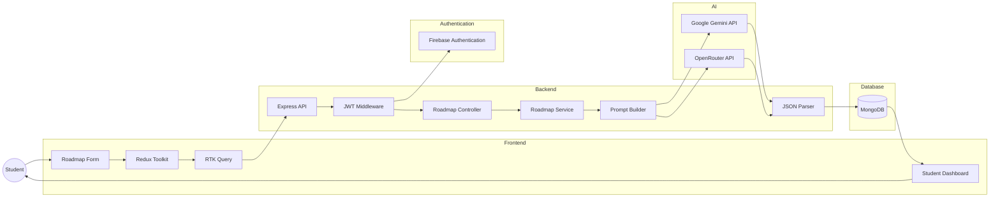

---

# 🚀 AI Roadmap Generation Flow

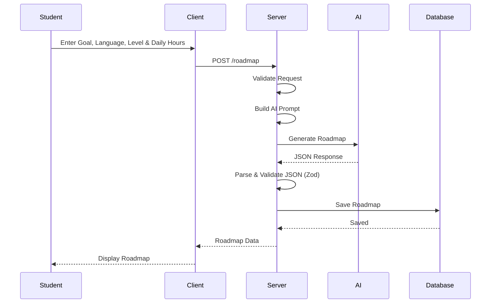

---

# 📊 ER Diagram

**Diagram Link**

*https://drive.google.com/file/d/1l0mUMqzZpYB4NmBY0Y6zk8ulpxUWtepL/view?usp=sharing*

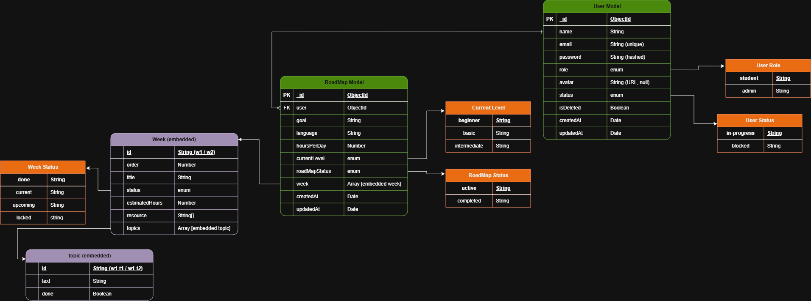

---

# 📸 Screenshots

| Home | Generate Roadmap |
|------|------------------|
| 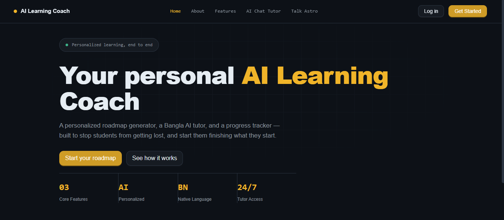 | 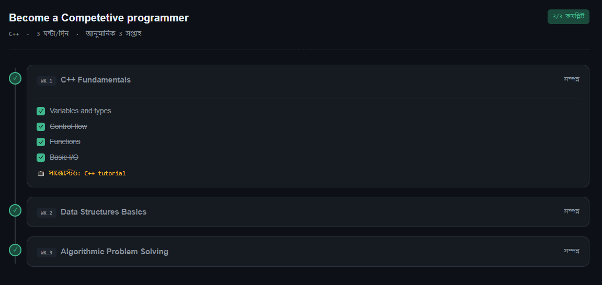 |

| AI Generated Roadmap | Checklist |
|----------------------|-----------|
| 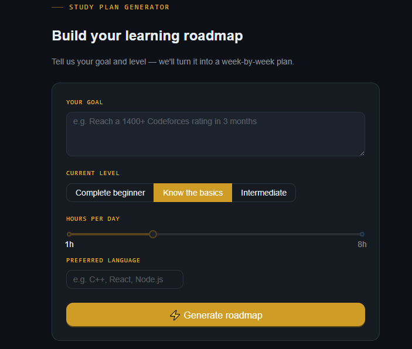 | 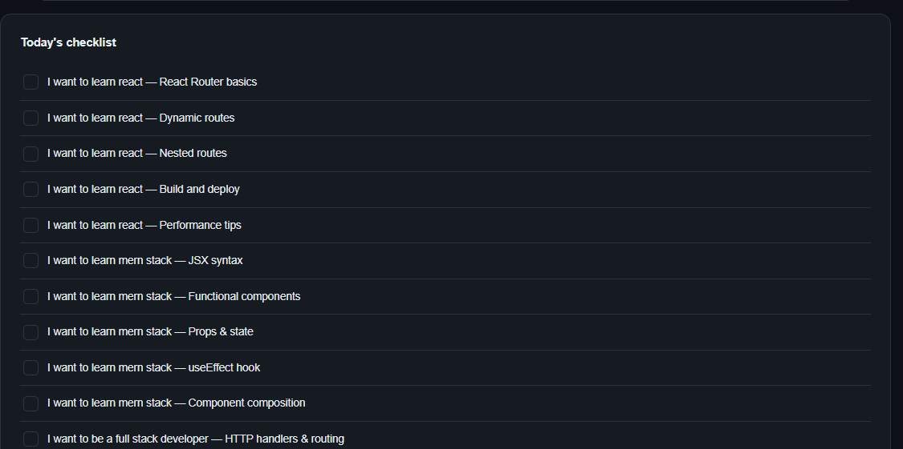 |

| Progress Tracking | AI Tutor |
|------------------|-----------|
| 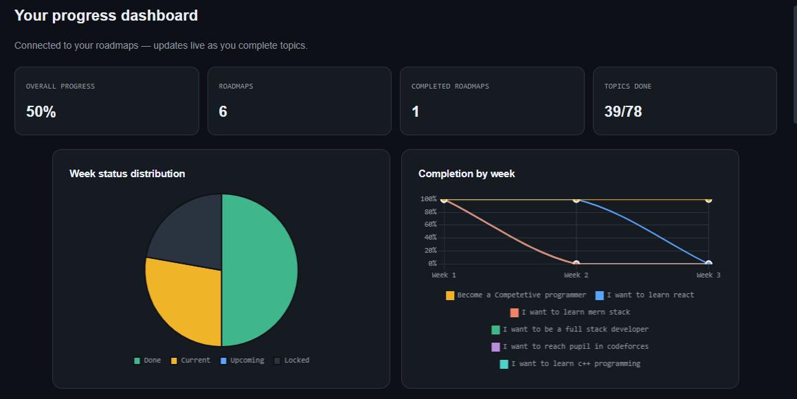 | 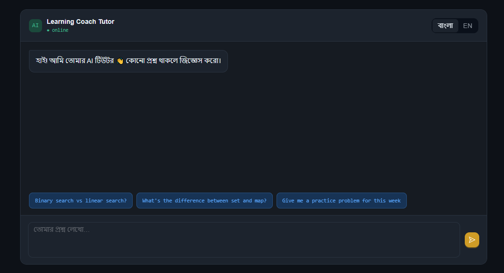 |

| Student Dashboard | Admin Dashboard |
|-------------------|-----------------|
| 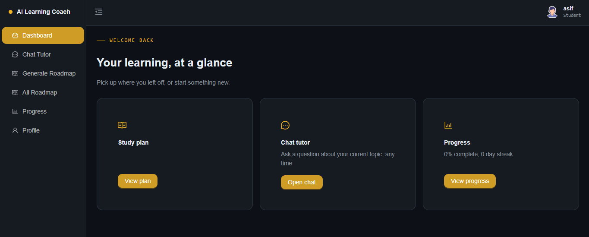 | 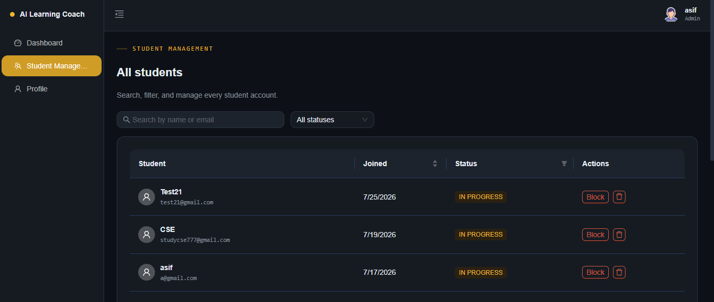 |

---

# ✨ Features

## 🧠 Personalized AI Roadmap Generator

Students provide:

- Learning Goal
- Programming Language
- Current Skill Level
- Daily Study Time

The AI generates a personalized roadmap containing:

- Weekly learning plan
- Topics for each week
- Learning resources
- Daily checklist
- Estimated completion timeline

---

## ✅ Daily Checklist

Each roadmap automatically generates actionable tasks.

Students can

- Mark tasks complete
- Track completed lessons
- Continue from previous progress
- Stay consistent throughout the roadmap

---

## 📈 Progress Tracking

Track learning progress using

- Completed Weeks
- Completed Topics
- Overall Completion Percentage
- Active Roadmaps

---

## 🤖 AI Chat Tutor

Students can ask programming questions in

- English
- Bangla

Features

- Context-aware answers
- Programming explanations
- Instant AI assistance

---

## 👥 Role-Based Dashboard

### Student

- Generate AI Roadmap
- Manage Roadmaps
- Complete Checklist
- Track Progress
- AI Tutor
- Profile Management

### Admin

- Dashboard Overview
- User Management
- Student Management
- Roadmap Monitoring

---

## 🔐 Authentication & Authorization

- Firebase Authentication
- JWT Authentication
- Protected Routes
- Role-Based Access Control (RBAC)

---

# 🛠 Tech Stack

## Frontend

- React.js
- TypeScript
- Redux Toolkit
- RTK Query
- React Hook Form
- Zod
- Tailwind CSS
- Ant Design

---

## Backend

- Node.js
- Express.js
- TypeScript
- MongoDB
- Mongoose

---

## Authentication

- Firebase Authentication
- JWT

---

## AI

- Google Gemini API
- OpenRouter API

---

# 🧠 Architecture Overview

AI Learning Coach follows a modular client-server architecture where AI processing, authentication, business logic, and data persistence are separated into independent layers. This architecture improves maintainability, scalability, and allows additional AI providers to be integrated with minimal changes.

---

## Authentication Flow

1. User signs in with Firebase Authentication.
2. Firebase returns an ID Token.
3. Backend verifies the token.
4. Backend generates a JWT.
5. Protected APIs validate the JWT before processing requests.

---

## AI Roadmap Generation Flow

### Step 1

Student fills the roadmap generation form.

Input Parameters

- Learning Goal
- Preferred Programming Language
- Current Skill Level
- Daily Study Time

↓

### Step 2

Frontend sends the request to the Express backend.

↓

### Step 3

Backend creates a structured AI prompt.

↓

### Step 4

The prompt is sent to **Google Gemini** or **OpenRouter**.

↓

### Step 5

The AI returns a roadmap **strictly in JSON format**.

Example

```json
{
  "weeks": [
    {
      "title": "Week 1",
      "topics": [
        "Variables",
        "Data Types",
        "Operators"
      ],
      "resource": "https://..."
    }
  ]
}
```

↓

### Step 6

Backend validates the JSON using **Zod**.

↓

### Step 7

The validated roadmap is transformed into the application's database schema.

↓

### Step 8

Roadmap is stored in MongoDB.

↓

### Step 9

The saved roadmap is returned to the frontend.

↓

### Step 10

Student views the roadmap and starts completing checklist items.

---

## Progress Tracking Flow

- Complete checklist
- Update completed topics
- Calculate progress percentage
- Update dashboard statistics

---

## State Management

- Redux Toolkit manages application state.
- RTK Query handles API requests and caching.
- Optimistic updates provide a smooth user experience.

---

# 📁 Project Structure

```text
Client
│
├── app
├── components
├── redux
│   ├── api
│   └── store
├── hooks
├── layouts
├── routes
├── utils
├── types
└── firebase

Server
│
├── app
│   ├── modules
│   │
│   ├── auth
│   ├── roadmap
│   ├── chatTutor
│   ├── progress
│   ├── user
│   └── admin
│
├── ai
│   ├── prompts
│   ├── providers
│   ├── services
│   └── parser
│
├── middleware
├── config
└── routes
```

---

# 🚀 Getting Started

## Prerequisites

- Node.js 18+
- MongoDB Atlas
- Firebase Project
- Google Gemini API Key
- OpenRouter API Key

---

## Installation

```bash
git clone https://github.com/AsifMohammedSifat/AI-Learning-Coach-Client

cd AI-Learning-Coach-Client

npm install
```

---

## Environment Variables

### Client

```env
NEXT_PUBLIC_API_URL=

NEXT_PUBLIC_FIREBASE_API_KEY=

NEXT_PUBLIC_FIREBASE_AUTH_DOMAIN=

NEXT_PUBLIC_FIREBASE_PROJECT_ID=

NEXT_PUBLIC_FIREBASE_STORAGE_BUCKET=

NEXT_PUBLIC_FIREBASE_MESSAGING_SENDER_ID=

NEXT_PUBLIC_FIREBASE_APP_ID=
```

### Server

```env
PORT=

DATABASE_URL=

JWT_SECRET=

JWT_EXPIRES_IN=

FIREBASE_PROJECT_ID=

FIREBASE_CLIENT_EMAIL=

FIREBASE_PRIVATE_KEY=

GEMINI_API_KEY=

OPENROUTER_API_KEY=
```

---

# 🌐 API Overview

| Method | Endpoint | Description |
|---------|----------|-------------|
| POST | `/roadmap` | Generate AI Roadmap |
| GET | `/roadmap` | Get User Roadmaps |
| PATCH | `/roadmap/:id/checklist` | Update Checklist |
| GET | `/progress` | Learning Progress |
| POST | `/chat-tutor` | AI Tutor |
| GET | `/chat/history` | Chat History |
| POST | `/auth/login` | User Authentication |

---

# 💡 Engineering Highlights

- AI-powered personalized roadmap generation
- Prompt engineering for structured JSON responses
- Zod validation for AI-generated data
- AI response parsing into database schema
- AI provider abstraction (Gemini/OpenRouter)
- Firebase Authentication + JWT Authorization
- Role-Based Access Control (RBAC)
- Daily checklist system
- Progress tracking dashboard
- RTK Query caching
- Modular MERN architecture
- Type-safe development using TypeScript

---

# 🚀 Future Improvements

- AI Quiz Generator
- Weak Topic Detection
- Spaced Repetition
- AI Interview Preparation
- Voice Tutor
- AI Streaming Responses
- Learning Streaks
- Achievement Badges
- Calendar Integration
- Email Study Reminders
- AI Flashcards
- PDF Roadmap Export

---

# 👨‍💻 Author

**Asif Mohammed Sifat**

- 🌐 Portfolio: https://asifsifat-swe.vercel.app
- 💻 GitHub: https://github.com/AsifMohammedSifat
- 💼 LinkedIn: https://www.linkedin.com/in/asifmohammedsifat/
- 📧 Email: asifmohammedsifat38@gmail.com

---

# ⭐ Support

If you found this project helpful, please consider giving it a ⭐ on GitHub!